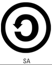

# Derechos

>
> ## 1. Derechos de la Propiedad Intelectual. Derechos de Autor
>
> * Se usan para ofrecer a los autores reconocimiento y recompensas economicas equitativas.
>
> * Tipos de derechos:
>   * Derechos morales
>   * Derechos de caracter economico
>       * Derechos exclusivos
>       * Derechos remuneracion
>   * Derechos compensatorios
>  
> * Una licencia de software es un contrato entre el autor/titular de los derechos de explotacion/distribuidor -> ***(autor/titular/distribuidor)*** y el usuario consumidor/usuario profesional o empresa -> ***(cunsumidor/profesional o empresa)***, para utilizar el software cumpliendo una serie de termino y condiciones establecidas dentro de sus clausulas: 
>
>
>>
>> ### 1.1. CopyLeft
>>
>> * Se puede porporcionar el uso libre y la distribucion de una obra, haciendo que las copias que se distribuya a partir de lo de la obra anterior, tenga las mismas libertades.
>>
>>
>
>
>>
>> ### 1.2. CopyRight
>>
>> * Es un conjunto de normars juridicas que afirman los derechos morales y patrimoniales que la ley concede a los autores.
>>
>>
>
>
>>
>> ### 1.3. Creative Commons
>>
>> * Organizacion creada por Lawrence Lessing.
>>
>> * Ofrece licencias libres que permiten a los autores depositar su obra de forma libre en internet, limitando los usos de dichas obras.
>>
>> * Se usa para compartir las obras de creacion bajo ciertas condiciones.
>>
>> * El autor autoriza el suo de su obra, peo sigue estando porteginda.
>>
>>
>>>
>>> ***Tipos de licencias CC***
>>>
>>> * ***Reconocimento (BY)***: El autor permite copiar, reproducir, distribuir, comunicar publicamente la obra, realizar obras derivadas y hacer de ella un uso comercial, siempre y cuando se cite y recozca el autor original. --> Te permite todo siempre que cites el autor original. 
>>> 
>>>
>>> * ***Sin obra derivada (ND)***: EL autor no permite generar obras derivadas.  
>>> 
>>>
>>> * ***No comercial (NC)***: El autor no permite el uso comercial.  
>>> 
>>>
>>> * ***Compartir igual (SA)***: El autor permite copiar, reproducir, distribuir, comunicar publicamente la obra, y generar obras derivadas pero bojo la misma licencia. --> Permite todo pero si la derivada tambien lo permite.  
>>> 
>>>
>>> ***Conjuntos***:
>>>
>>> * ***Reconocimiento***: Literalmete lo mismo que BY  
>>> 
>>>
>>> * ***Reconocimiento - Sin obra derivada***: Permite todo lo de BY excepto generar obras derivadas --> es decir solo copiar, reproducir, ditribuir, comunicar publicamente la obra, y hacer de ella uso comercial siempre que se cite el autor original.  
>>> 
>>>
>>> * ***Reconocimiento - Sin obra derivada - No comercial***: Como la anterior, Permite todo lo de BY excepto generar obras derivadas y su uso comercial.  
>>> 
>>>
>>> * ***Reconocimiento - No comercial***; Permite todo lo del BY excepto, su uso comercial.  
>>> 
>>>
>>> * ***Reconocimiento - No comercial - Compartir igual***: Permite todo lo del BY excepto, su uso comercial y las obras derivadas tambine tinen que tener licencia del mismo tipo.  
>>> 
>>>
>>> * ***Reconocimiento - Compartir igual***: Permite todo lo del BY excepto, que los derivados tienen que tener la misma licenca.  
>>> 
>>>
>>>
>>>
>>> * El autor reserva el derecho, en cualquier momento, de explotar la obra con otra licencia, o, incluso de retirarla, pero la licencia previamente otorgada continuara vigente
>>> * No tienen caracter de exclusividad, por tanto el autor puede otorgar otras licencias sobre la misma obra con conidciones diferentes, pero las subsiguientes licencias solo se podran otorgar en regimen de no exclusividad.
>>>
>>>
>>
>>
>
>

>
> ### 2. Propiedad Intelectual
>
> * La propiedad intelectual es un conjunto de derechos, personales (morales) y patrimoniales (economicos) que corresponde a los autores sobre las obras de su creacion.
>
> *  Se refiere a todas las creaciones originales en los ámbitos literarios, artísticos o científicos. Estas creaciones pueden ser expresadas a través de cualquier medio o soporte, ya sea tangible (como un libro o una pintura) o intangible (como una composición musical o un software). La ley reconoce y protege los derechos sobre estas obras para sus creadores.
>
> * No todas las ideas o información pueden ser objeto de propiedad intelectual. Por ejemplo, las ideas abstractas, los hechos científicos y cualquier conocimiento que sea de dominio público y no pueda ser apropiado por una persona en particular, no se consideran parte de la propiedad intelectual. Estos elementos son considerados parte del patrimonio común y están disponibles para ser utilizados por cualquier persona.