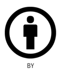
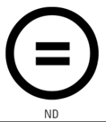
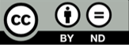
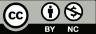

# Derechos

>
> ## 1. Derechos de la Propiedad Intelectual. Derechos de Autor
>
> * Son esenciales pra proteger la creatividad hunmana al ofrecer a los autores reconocimiento y recompensas economicas equitativas.
> * `(NO MUY IMPORTANTE)`: El sistema grantaiza a los creadores la distribucion de sus obras sin temor a que se realicen copias no autorizadas o pirateria.
> * `(Se define con deteniniento en el punto 2)` La ***propiedad intelectual*** es un comcepto amplio, que abarca tanto a los derechos de autor como los derechos conexos a los drechos de autor.
>
> * Derechos morales
> * Derechos de caracter economico
>   * Derechos exclusivos
>   * Derechos de remuneracion
> * Derechos compesatorios
>
> * Una licencia de software es un contrato entre el autor/titular de los derechos de explotacion/distribuidor y el usuario consumidor/usuario profesional o empresa, para utilizar el software cumpliendo una serie de termino y condiciones establecidas dentro de sus clausulas:
>   * Copyright
>   * Copyleft
>   * Creative Commons
>
>>
>> ### 1.1. Copyleft
>>
>> * Es una practica legal que consiste en el ejercicio del derecho de autor, con el objetico de proporcionar el uso libre y distribucion de una obra, exigiendo que los concesionarios presierven las mismas libertades al distribuir sus copias y derivados.
>> * `(No muy importante)`: Los autores pueden aplicar una licencia con copyleft a programas informaticos, obras de arte, textos o cualquier tipo de trabajo creativo que sea regido por los derechos de autor.
>>
>>
>
>
>>
>> ### 1.2. CopyRight
>>
>> * EL derecho de autor es un conjunto de normas juridicas y principios que afirman los derechos morales y patrimoniales que la ley concede a los autores, por el simple hecho de la creacion de una obra literaria, artistica, musica, cientifica o didactica, este publicada o inedita.
>>
>>
>
>
>>
>> ### 1.3. Creative Commons
>>
>> * Es una organizacion sin animo de lucro que fue fundada pro Lawrece Lessing, Profesor de Derecho de la Universida de Stanford, que ofrece modelos de licencias libre que permiten a los autores depositar su obra de forma libre en internet, limitando los usos que de dichas obras se pueden hacer.
>> * Estas licencias nacen para compratir y reutilizar las obras de creacion bajo ciertas condiciones. El autor autoriza el usuo de u obra, pero la obra continua estando protegida.
>> * `(Aclaracion)`: Frente al copyright que quiere decir `"Todos los derecho reservados"`, las creative commos porponen `"Algunos drechos reservados"`
>>
>> * Tipos:
>>   * ***Reconocimento (BY)***: El autor permite copiar, reporducirm distribuir, comunicar publicamnete la obra, realizar obras derivadas y hacer de ella un uso comercial, siempre y cuando se cite y reconezca al autor original.  
>> 
>>
>>   * ***Sin obra derivada (ND)***: EL autor no permite generar obras derivadas.  
>> 
>>   * ***No comercial (NC)***: El autor no permite el uso comercial.  
>> 
>>   * ***Compartir igual (SA)***: El autor permite copiar, reproducir, distribuir, comunicar publicamente la obra, y generar obras derivadas pero bojo la misma licencia.  
>> 
>>
>>  
>>  
>>  
>>
>> * ***Reconocimiento***: El autor permite copiar, reproducir cominicar publicamente la obra, realizar obras derivadas siempre y cuando se cite y reconozca al autor original.  
>> 
>>
>> * ***Reconocimiento - Sin obra derivada***: El autor permite copiar, reproducir, distribuir, comunicar publicamente la obra, y hacer de ella un uso comercial siempre y cuando se cite y reconzca al autor original. No permite generar oba derivada.  
>> 
>>
>> * ***Reconocimiento - Sin obra derivada - No comercial***: EL autor permite copiar, reproducir, distribuir, comunicar publicamente la obra, siempre y cuando se cite y reconozca al autor original. No permite generar obra derivada ni utilizar ni uilizrla con finalidades comerciles.  
>> 
>>
>> * ***Reconocimiento - No comercial***: EL autor permite copiar, reproducir, distribuir, comunicar publicamente la obra y generar obras derivadas siempre y cuando se cite y reconozca al autor original. No se permite utilizar la oba con fines comerciales.  
>> 
>>
>> * ***Reconocimiento - No comercial - Compartir igual***: El autor permite copiar, reproducir, distribuir, comunicar publicamente la obra y generar obras derivadas siempre y cuando se cite y reconozca al autor original. La distribucion de las obras derivadas debera hacerse bajo una licencia del mimo tipo. No se permite utilizar la obra con fines comerciales.  
>> 
>>
>> * ***Reconocimiento - Compartir igual***: El autor permite copiar, reproducir distribuir, comunicar publicamente, la obra, genera obras derivadas y hacer de ellas un uso comercial siempre y cuando se cite y reconozca al autor original. Se premite la distribucion de las otras derivadas pero unica y exlcusivamente con una licencia del mimo tipo.  
>> 
>>
>> * `(Nota)`: El autor reserva el derecho, en cualquier momento, de explotar la obra con otra licencia, o, incluso de retirarla, pero la licencia previamente otorgada continuara vigente
>>   * No tienen caracter de exclusividad, por tanto el autor puede otorgar otras licencias sobre la misma obra con conidciones diferentes, pero las subsiguientes licencias solo se podran otorgar en regimen de no exclusividad.
>>   * El uso de obras con estas licencias obliga a que el usuario decide utilizar una obra con una licencia, se convierte en licenciatario y se compromete a aceptar y respetar las condiciones de la licencia establecida por el autor.
>>   * En el caso de incumplimiento o ifracccion de una licencia, el autor, como con cualquier otra obra y licencia, habra de recurrir a los tribunales.
>>   * Cuando se trate de una infraccion directa, el autor le podra demandar tanto por infraccion de la propiedad intelectual como por incumplimiento contractual.
>>   * El derecho moral de integridad recogido por la legislacion española queda protegido, aunque no aparezca en las licencias
>>   * Estas licencias no sustituyen ni reducen los derechos que la ley confiere al autor; por tanto, el autor podria demandar a un usuario que, con cualquier licencia, hubiera mutilado su o modificado su obra causando un prjuicio a su reputacio o sus intereses.
>>   * Por descontado, la decision de cuando ha habido mutilacion y de cuando la mutilacion perjudica la reputacion o los intereses del autor quedaria en manos de cada Juez o Tribunal.
>> 
>> 
> 
> 

>
> ## 2. Propiedad Intelectual
>
> * La propiedad intelectual es el conjunto de derechos de autor, personales y patriponiales que corresponden a los autores sobre las obras de su creacion.
>
> * Las obras que son objeto de propiedad intelectual son todas las creaciones originales literarias, artistica o cintificas expresdas por cualquier medio o sopote, tangible o intangible, actualmente conocido o que se invente en el futuro.
>
> * Lo que no puede incluirse en la definicion anterior son las ideas, la informacion, y todo conocimieto que es patrimonio comun y no es susceptible que es patrimonio comun y no es susceptible de apropiacion
> 
> 